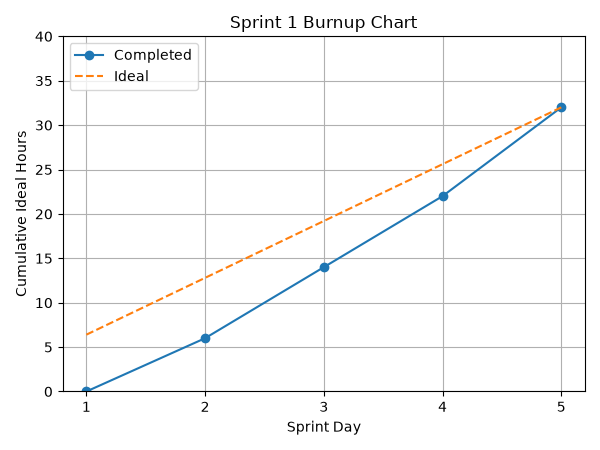

# Sprint 1 Report
**Product:** StudyPet-Plus | **Team:** StudyPet-Plus | **Date:** June 28, 2026 | **Sprint Period:** June 22–28, 2026 (Mon–Sun)

## Retrospective: Start / Stop / Continue

### Stop Doing
| Action | Reason |
|--------|--------|
| Configuring local environment variables and Auth.js provider secrets ad hoc per team member | Inconsistent `.env` setups caused repeated magic-link and session debugging early in the sprint. A shared `.env.example` and setup doc should ship with the app shell from day one. |
| Merging feature branches directly into main without a passing pipeline check | A couple of early commits broke the build for other members before the dev pipeline was fully wired up. |

### Start Doing
| Action | Reason |
|--------|--------|
| Documenting the Auth.js email-provider and magic-link configuration as it is built | Several members needed to reproduce the same passwordless login locally, and undocumented setup slowed onboarding to the codebase. |
| Standing up CI checks (lint, build) before feature work ramps up | Catching formatting and build errors on every push, rather than only before the demo, keeps the app shell stable as more stories land on top of it. |

### Keep Doing
| Action | Reason |
|--------|--------|
| Splitting the sprint into clear frontend/backend/pipeline lanes (auth, dashboard, app shell, CI/CD, demo prep) | This let team members work in parallel on Sprint 1's foundational stories without blocking one another. |
| Async daily standups in Discord | Kept the team aligned on progress and blockers while everyone was still ramping up on the stack. |

## Sprint Outcomes

### Completed Stories
- US-1: Passwordless magic-link authentication via Auth.js (8h) ✅
- US-2: Protected dashboard route requiring an authenticated session (6h) ✅
- US-3: Next.js app shell — layout, navigation, and sidebar scaffolding (8h) ✅
- US-4: Dev pipeline — CI lint/build checks and deployment setup (6h) ✅
- US-5: Sprint 1 demo presentation and walkthrough (4h) ✅

### Incomplete Stories
- None. All Sprint 1 backlog items were implemented and demoed.

## Velocity

| Metric | Value |
|--------|-------|
| User stories completed | 5 |
| Ideal hours completed | 32 / 32h |
| Sprint period | 5 active development days (June 22–26) within the June 22–28 sprint week |
| User stories/day | 1.0 |
| Ideal work hours/day | 6.4h |

## Burnup Chart

### Daily Progress Data

| Sprint Day | Date | Completed Hours | Ideal Hours |
|------------|------|-----------------|-------------|
| Day 1 | Jun 22 | 0h | 6.4h |
| Day 2 | Jun 23 | 6h | 12.8h |
| Day 3 | Jun 24 | 14h | 19.2h |
| Day 4 | Jun 25 | 22h | 25.6h |
| Day 5 | Jun 26 | 32h | 32h |
