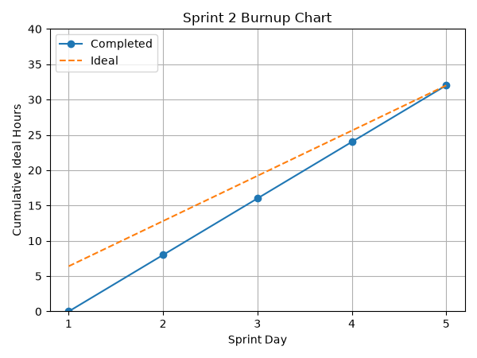

# Sprint 2 Report
**Product:** StudyPet-Plus | **Team:** StudyPet-Plus | **Date:** July 5, 2026 | **Sprint Period:** June 29–July 5, 2026 (Mon–Sun)

## Retrospective: Start / Stop / Continue

### Stop Doing
| Action | Reason |
|--------|--------|
| Committing unformatted code and mixed line endings | Lint formatting cleanup and LF line-ending fixes required dedicated time at the end of the sprint to unblock CI builds. |

### Start Doing
| Action | Reason |
|--------|--------|
| Early integration of UI elements with live backend data | Dashboard components rely heavily on backend data; wiring them up sooner de-risks the mid-sprint integration check instead of surfacing gaps late. |
| Verifying mobile/responsive layouts alongside each CRUD story, not just at sprint end | Assignment and course views needed a dedicated pass for mobile card views and inline status toggles, which was safer to validate earlier. |

### Keep Doing
| Action | Reason |
|--------|--------|
| Daily async standups in Discord | Kept the team unblocked and aligned on yesterday/today/blockers without requiring extra sync meetings. |
| Using AI-assisted co-driving | Allowed the team to efficiently complete 32 ideal hours of CRUD and UI work in a one-week sprint. |

## Sprint Outcomes

### Completed Stories
- US-1: Course/Assignment/Quest/Pet data model and Prisma migration (2.5h) ✅
- US-2: Create, edit, and delete courses with API and UI (5.5h) ✅
- US-3: Create and track course-tied assignments with status dropdowns (6h) ✅
- US-4: Manage quests with XP rewards and status changes (7h) ✅
- US-5: Planner dashboard featuring stats, streaks, and due dates (3h) ✅
- US-6: StudyPet placeholder component wired into the dashboard (2h) ✅
- US-7: Extended seed script to load idempotent demo data (1.5h) ✅
- US-8: Mobile responsive views and CI lint/build fixes (4.5h) ✅

### Incomplete Stories
- None. All Sprint 2 backlog items were implemented and verified on the live site.

## Velocity

| Metric | Value |
|--------|-------|
| User stories completed | 8 |
| Ideal hours completed | 32 / 32h |
| Sprint period | 5 active development days (June 29–July 3) within the June 29–July 5 sprint week |
| User stories/day | 1.6 |
| Ideal work hours/day | 6.4h |
| Average user stories/day (Sprints 1–2) | 1.3 |
| Average ideal work hours/day (Sprints 1–2) | 6.4h |

## Burnup Chart

### Daily Progress Data

| Sprint Day | Date | Completed Hours | Ideal Hours |
|------------|------|-----------------|-------------|
| Day 1 | Jun 29 | 0h | 6.4h |
| Day 2 | Jun 30 | 8h | 12.8h |
| Day 3 | Jul 1 | 16h | 19.2h |
| Day 4 | Jul 2 | 24h | 25.6h |
| Day 5 | Jul 3 | 32h | 32h |
