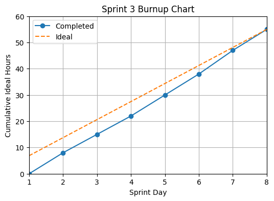

# Sprint 3 Report
**Product:** StudyPet-Plus | **Team:** StudyPet-Plus | **Date:** July 14, 2026 | **Sprint Period:** July 7–14, 2026

## Retrospective: Start / Stop / Continue

### Stop Doing
| Action | Reason |
|--------|--------|
| Treating validation and error handling as final-day work | The AI provider layer was implemented, but schema checks, rate-limit handling, and clear fallback errors still needed hardening. These should be tested alongside every AI-generation feature. |

### Start Doing
| Action | Reason |
|--------|--------|
| Maintaining a daily Definition-of-Done checklist for each AI study-material story | It should verify validated persistence, error states, and a short end-to-end manual test so “done” means demo-ready. |
| Reserving a short integration block before sprint review | This will validate the complete notes → provider → flashcards → quiz/review/XP/pet-widget experience instead of validating features only in isolation. |

### Keep Doing
| Action | Reason |
|--------|--------|
| Dividing work into explicit models, server actions, and UI tasks | This supported parallel work across notes, provider abstraction, flashcards, Study Groups, calendar subscriptions, assignments/tasks, onboarding, archiving, and group-task calendar work. |
| Recording visible codebase evidence on the sprint board | Linking work to models, actions, routes, and components makes the team’s status easier to review and reduces meeting ambiguity. |

## Sprint Outcomes

### Completed Stories
- US-3.1: Notes management — paste, save, and manage notes by course (3 pts) ✅
- US-3.2: AI provider layer — Gemini-first provider with DeepSeek fallback (5 pts) ✅ *(superseded in Sprint 4: DeepSeek was replaced by a self-hosted OpenAI-compatible LLM as the primary provider, with Gemini as the fallback. The current chain in `src/lib/ai/provider.ts` is local → Gemini.)*
- US-3.3: Topic-tagged flashcards generated from notes and persisted (5 pts) ✅
- US-3.4: Multiple-choice quiz generation and persistence (5 pts) ✅
- US-3.5: Flashcard review flow and initial XP awards (3 pts) ✅
- US-3.6: Study Groups — memberships, roles, invites, channels, messages, and tasks (8 pts) ✅
- US-3.7: Calendar subscriptions — ICS feeds, parser, calendar views, and checklist (5 pts) ✅
- US-3.8: Pomodoro timer dashboard widget (2 pts) ✅
- US-3.9: First-run onboarding — name, time zone, avatar, and settings path (5 pts) ✅

### Incomplete Stories
- None — all Sprint 3 user stories were completed.

## Velocity

| Metric | Value |
|--------|-------|
| User stories completed | 9 |
| Story points completed | 41 / 41 |
| Estimated ideal work hours | 55h |
| Sprint period | 8 calendar days (July 7–14) |
| User stories/day | 1.125 |
| Ideal work hours/day | 6.875h |
| Average user stories/day (Sprints 2–3) | 1.06 |
| Average ideal work hours/day (Sprints 2–3) | 5.94h |

## Burnup Chart

### Daily Progress Data

| Sprint Day | Date | Completed Hours | Ideal Hours |
|------------|------|-----------------|-------------|
| Day 1 | Jul 7 | 0h | 0h |
| Day 2 | Jul 8 | 6h | 8h |
| Day 3 | Jul 9 | 14h | 16h |
| Day 4 | Jul 10 | 22h | 24h |
| Day 5 | Jul 11 | 30h | 31h |
| Day 6 | Jul 12 | 38h | 39h |
| Day 7 | Jul 13 | 47h | 47h |
| Day 8 | Jul 14 | 55h | 55h |
