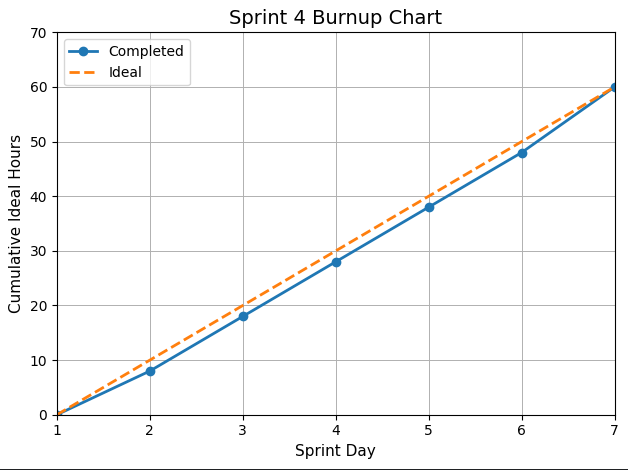

# Sprint 4 Report
**Product:** StudyPet-Plus | **Team:** StudyPet-Plus | **Date:** July 22, 2026

## Retrospective: Start / Stop / Continue

### Stop Doing
| Action | Reason |
|--------|--------|
| Deferring UI polish and accessibility validation to the final days of the sprint | Responsive layouts, accessibility checks, and empty/error states require earlier validation to ensure a fully demo-ready experience. |
| Relying on feature-level completion without full end-to-end verification | Some features were functionally complete in isolation, but required additional integration testing across quiz-taking, analytics, XP updates, and pet state synchronization. |

### Start Doing
| Action | Reason |
|--------|--------|
| Incorporating end-to-end testing checkpoints throughout the sprint | Each major feature should include a complete user-flow validation to ensure seamless integration before the final demo. |
| Prioritizing demo-readiness alongside implementation | Preparing seed data, validating UI responsiveness, and rehearsing the user journey earlier reduces last-minute risk. |
| Tracking polish tasks (UI, accessibility, responsiveness) as first-class backlog items | Ensures they have clear acceptance criteria rather than treating them as optional final steps. |

### Keep Doing
| Action | Reason |
|--------|--------|
| Structuring development into clear backend models, API routes, and frontend components | This separation supports parallel development and scalability, as demonstrated by the success of the quiz and analytics logic. |
| Maintaining visible progress through the sprint board and linking features to concrete code artifacts | This continues to improve transparency and coordination across team members. |
| Focusing on delivering a complete user-centered workflow | The end-to-end study loop (quiz → analytics → recommendation → XP → pet progression) reflects strong alignment with product goals. |

## Sprint Outcomes

### Completed Stories
- US-4.01: Quiz taking flow with scoring and persistence (5 pts) ✅
- US-4.02: QuizAttempt and QuestionResult persistence (3 pts) ✅
- US-4.03: Weak-topic analytics aggregation (5 pts) ✅
- US-4.04: "Review next" recommendation system (5 pts) ✅
- US-4.05: XP rewards for quest completion (3 pts) ✅
- US-4.06: XP rewards for quiz completion (3 pts) ✅
- US-4.07: XP rewards for flashcard review (2 pts) ✅
- US-4.08: Daily streak tracking system (3 pts) ✅
- US-4.09: Pet evolution based on XP thresholds (5 pts) ✅
- US-4.10: Live pet widget displaying XP, stage, and streak (3 pts) ✅
- US-4.S1: MFA authentication — authenticator-app TOTP and WebAuthn passkey second factors (8 pts) ✅
- US-4.S2: Google OAuth login as an optional provider alongside the magic link (5 pts) ✅

### Incomplete Stories
- US-4.11: Responsive UI validation and refinement (5 pts) — responsive calendar grids landed, but the 44px touch-target pass is applied in only one component
- US-4.12: Empty and error state UX validation (3 pts) — `try/catch` error handling was added across 14 API routes; the UI-side empty/error state sweep is unfinished
- US-4.13: Accessibility validation (ARIA, keyboard, contrast) (5 pts) — partial ARIA/role coverage (51 of 119 component files); keyboard and contrast audit outstanding
- US-4.S3: Full production email delivery setup (3 pts)

## Velocity

| Metric | Value |
|--------|-------|
| Stories completed | 12 |
| Story points completed (recorded scope) | 37/55 |
| Stretch points additionally delivered | 13 (US-4.S1, US-4.S2) |
| Ideal work hours completed | 60 hours |
| Sprint days | 7 |
| Stories/day | 1.71 |
| Ideal hours/day | 8.57 hours |
| Avg. stories/day (Sprints 2–4) | 1.45 |
| Avg. ideal hours/day (Sprints 2–4) | 7.35 hours |

*US-4.14 (Bug Bash & Polish) and US-4.15 (Final Demo Preparation) were carried out as continuous
work through the sprint rather than tracked to a single completion date, and so are not counted in
either list above.*

## Burnup Chart

### Summary
Sprint 4 successfully delivered all core MVP functionality, including quiz-taking, analytics, recommendations, and gamification through the StudyPet system. The application now supports a complete end-to-end study experience and is ready for final demo presentation. However, several polish and quality-focused stories (responsiveness, accessibility, and UX validation) remain incomplete and require additional manual testing. Two stretch goals were also delivered — MFA (TOTP and passkeys) and optional Google OAuth sign-in — while full production email delivery was deferred. Overall, the sprint achieved its primary objective of delivering a fully functional, demo-ready product, with remaining work focused on refinement rather than capability.